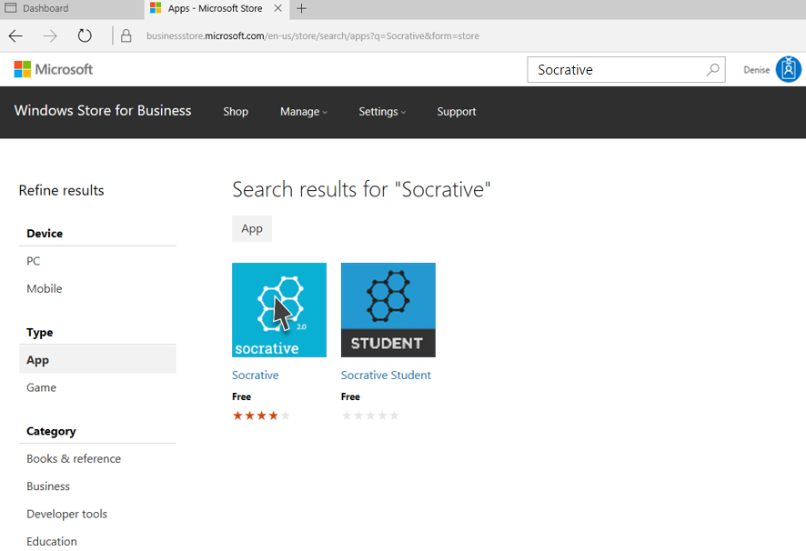

---
# required metadata

title: Acquire Windows Store for Business apps
titleSuffix: Intune for Education
description: Learn how to purchase apps from the Windows Store for Business.
keywords:
author: barlanmsft
ms.author: barlan
manager: angrobe
ms.date: 03/24/2017
ms.topic: article
ms.prod:
ms.service:
ms.technology:
ms.assetid: e38a808b-bbfb-4cbc-835a-f99b1c85a048
searchScope:
 - IntuneEDU

# optional metadata

#ROBOTS:
#audience:
#ms.devlang:
#ms.reviewer:
#ms.suite: ems
#ms.tgt_pltfrm:
#ms.custom:

---

## Add Windows Store for Business apps

Apps that you've acquired from the Windows Store for Business are automatically available in Intune for Education. Any time you make changes to your app ownership, such as buying new apps or revoking purchases, that change is reflected in Intune for Education.

1. In the [Intune for Education](https://intuneeducation.portal.azure.com) console, choose **Apps**.

2. Under **Windows Store apps**, select **+ New app** to open your Windows Store for Business account. You can search for apps that you want to add using the search bar at the top right corner of the screen.

> [!NOTE]
> If you have not added Intune for Education as a management tool, you will need to [activate it before you can take any actions](https://technet.microsoft.com/itpro/windows/manage/apps-in-windows-store-for-business#licensing-model).

  

  After you find it, go ahead and acquire the required number of licenses for the app. Unlimited licenses are the standard for all free apps.

  

  Once you've acquired the licenses, you'll see a confirmation message that lets you know you've acquired the app.

3. Intune for Education will update to show your purchase in the list of **Windows Store apps**. This could take up to 12 hours, but usually is complete within a couple of minutes.

  

4. You can now [install the app on devices](install-apps.md).
