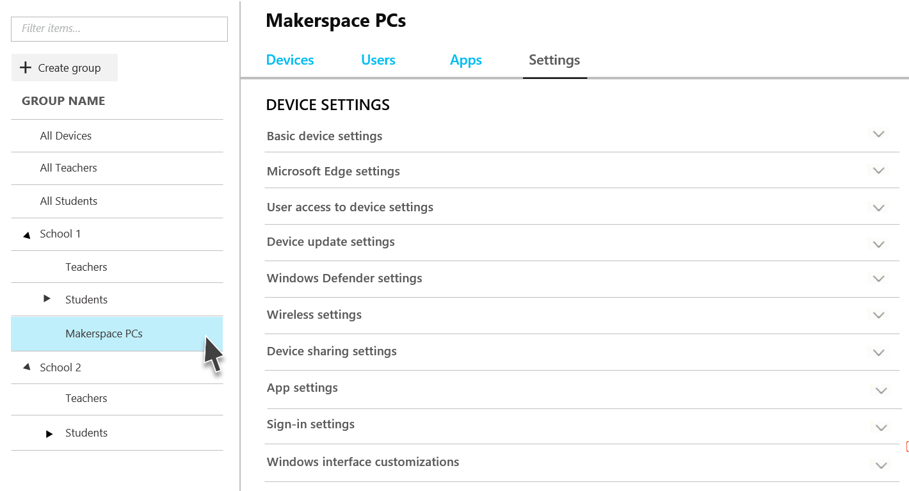

---
# required metadata

title: Available settings
titleSuffix: Intune for Education
description: Learn more about the settings available for Intune for Education.
keywords:
author: lenewsad
ms.author: lanewsad
manager: angrobe
ms.date: 02/20/2018
ms.topic: article
ms.prod:
ms.service: microsoft-intune
ms.technology:
ms.assetid: 2221009e-68cf-4171-8118-0d750b0f35f1
searchScope:
- IntuneEDU

# optional metadata

#ROBOTS:
#audience:
#ms.devlang:
#ms.reviewer: rashok
#ms.suite: ems
#ms.tgt_pltfrm:
#ms.custom: intune-education

---

# Available settings for Intune for Education

Configuring settings is one of the key ways you can secure your Windows 10 devices and create the right kinds of access to enhance the learning experience. Intune for Education provides many settings that allow you to customize these experiences, both for individual groups and their subgroups.

Most settings are set up to either **Block** or **Allow** access to a certain device feature, where **Not configured** is the device's default setting or a user-chosen setting.

> [!NOTE]
> These user, app, and device settings differ from [tenant settings](what-are-tenants.md).

You can find these settings by first selecting a **group**, then choosing **Settings**.

  

Much of the information in the **What it does** column can also be found in the Intune for Education console; this format is designed to make it easier for you to search through the settings for specific items.

## Basic device settings

|Setting|What it does|
|---|---|
|Block manual unenrollment|Block users from manually unenrolling devices from management.|
|Remove built-in Windows 10 apps|Uninstall certain built-in Windows apps. Learn what those apps are [below](available-settings.md#additional-information-about-removing-built-in-apps).|
|Block camera|Block user access to the device camera.|
|Block OneDrive file sync|Block OneDrive Sync for these devices and users.|
|Block removable storage|Block users from using removable storage such as USB drives and external hard drives.|
|Block Internet sharing|Block users from using Internet Sharing to share the device’s Internet connection.|
|Block Cortana|Block Cortana, the digital assistant built into Windows 10 that can answer questions and perform tasks.|
|Block adding provisioning packages|Block users from adding new provisioning packages containing device settings.|
|Block removing provisioning packages|Block users from removing provisioning packages containing device settings.|
|Block changing time and date settings|Block users from changing the device date and time settings.|
|Block changing language settings|Block users from changing the device language.|
|Send diagnostic data|Define whether to collect and send anonymous usage data to Microsoft to help improve Windows.|
|Block changing device region settings|Block users from changing region settings, such as country and language.|
|Block changing power and sleep settings|Block users from changing power and sleep settings.|
|Force Start menu size|Define whether to force the Start menu to appear full screen.|
|Block Windows Spotlight|Block all Windows Spotlight features on these devices.|
|Location services|Block apps from using location services to access the device’s location.|

### Additional information about removing built-in apps

This setting is automatically turned on when the "Optimize devices for shared use" setting is turned on. The following apps are fully removed from your users' computers when this setting is turned on:

* 3DBuilder
* Bing Weather
* Desktop App Installer
* Get Started
* Microsoft Office Hub
* Solitaire Collection
* One Connect
* Windows Feedback Hub
* Xbox
* Groove Music
<!--* Zune Video-->
* Mail
* Calendar

## Microsoft Edge settings

|Setting|What it does|
|---|---|
|Configure homepages|Choose what homepages open every time someone begins a new session browsing with Microsoft Edge.|
|Block address bar suggestions|Block Edge from suggesting possible search terms or previously visited websites as you type a URL or search term.|
|Block search suggestions|Block Edge from suggesting possible websites as you type a URL or search term.|
|Block InPrivate browsing|Block users from using InPrivate browsing, which stops Edge from saving data like browsing history and cookies.|
|Block adult content using a SafeSearch filter|Setting to “Block” uses a strict rather than moderate SafeSearch filter to block adult content.|
|Block browser extensions|Block users from using extensions to customize Edge with added functionality from Microsoft and other sources.|
|Block first run page|Block users from seeing the first run page for the first time they open Edge.|
|Clear browsing data upon exit|Automatically erase history, cookies, and cached files after exiting Edge.|
|Block pop-ups|Block websites from opening new windows.|
|Block password manager|Block users from using the password manager to save passwords.|
|Block automatically filling form entries|Block saving data entered in a form field online.|
|Do-Not-Track headers|Require Microsoft Edge to ask that websites not track user data.|
|Default search engine|Select Bing, Yahoo, or Google as the default search engine for Microsoft Edge. If you or another admin has set up a custom search engine in the full Intune experience, you can define that custom search engine as the default here.|
|Use cookies|Cookies can store website settings or track user’s browsing behavior.|
|Block developer tools|Block users from accessing developer tools.|
|Block access to about:flags page|Block access to the about:flags page, which contains experimental settings and features.|
|Require intranet sites to be viewed in Internet Explorer|If set to “Block”, internal traffic is sent to Edge instead of Internet Explorer.|
|Sync Microsoft Edge favorites with Internet Explorer|Sync all favorites added to Edge to Internet Explorer.|

## Windows Defender settings

> [!NOTE]
> Certain Windows Defender settings are available at the [tenant](what-are-tenants.md) level.

|Setting|What it does|
|---|---|
|Block user access to Windows Defender settings|Block users from modifying Windows Defender settings on the device.|
|Real-time monitoring|Enable always-on scanning for malware, spyware, and other threats.|
|Behavior monitoring|Enable Defender to check for certain known patterns of suspicious activity.|
|Prompt users for sample submission|Define whether files that might need further analysis are automatically sent to Microsoft.|
|Type of system scan to perform|Choose whether Windows Defender uses a quick scan, a full scan, or not scan devices at all.|
|Daily quick scan time|Choose what hour of the day Windows Defender runs a daily quick scan.|
|Scan all downloaded files|Automatically scan all downloaded files for malware.|
|Scan scripts run in Microsoft web browsers|Scan all scripts a website attempts to run in Edge and Internet Explorer.|
|Scan removable drives during full scan|Include removable drives, such as USB sticks, during full scans.|
|Scan files opened over the network|Scan all files that are opened by users from websites while using the network.|
|Scan remote folders during full scan|Scan any folders on remote locations during full scans.|
|Scan archive files|Scan archive files, like .zip or .rar.|
|Scan incoming email|Scan all email received over the network.|
|Scan file and program activity|Scan for malware when files or programs are opened and alerts users of suspicious activity.|
|Days before quarantined malware is removed|Define the number of days that a file is saved before removing (0 = immediately delete).|
|Set update frequency|Define how frequently Defender checks for and downloads anti-malware updates.|
|Potentially Unwanted Applications protection|Defender alerts the user and blocks potentially unwanted software that attempts to install itself on devices.|
|Enable cloud-based protection|Get real-time protection when Defender sends info to Microsoft about potential security threats. This feature works best with “Prompt users for sample submission” set to automatically send samples.|
|Block suspicious files|If this setting is on, Windows Defender Antivirus will be more aggressive when identifying suspicious files to block and scan; otherwise, it will be less aggressive and therefore block and scan with less frequency. You can select **Default**, **High**, **High+**, and **Zero Tolerance**. **High** aggressively blocks unknown files while minimizing impact to impacting the device performance. **High+** aggressively blocks unknown files, but may negatively impact device performance. **Zero tolerance** blocks all unknown files from running.|
|Actions on detected malware threats|Windows Defender automatically quarantines detected malware.|
|Enable Network Inspection Service|Helps protect devices against network-based exploits by using the signatures of known vulnerabilities from the Microsoft Endpoint Protection Center to help detect and block malicious traffic.|
|Exclude files with these extensions from scans and real-time protection|Define the types of files that you want users to be able to access without scanning for security threats.|
|Exclude processes from scans and real-time protection|Define the types of processes that you want users to be able to run without scanning for security threats.
|Exclude directories with these extensions from scans and real-time protection|Define the file locations that you want users to be able to access without scanning for security threats.|

## Wireless settings

|Setting|What it does|
|---|---|
|Block using Wi-Fi Sense to automatically connect to open Wi-Fi hotspots|Choose whether to block devices from automatically connecting to Wi-Fi hotspots.|
|Block Bluetooth|Block devices from using Bluetooth.|
|Block Bluetooth discoverability|Block devices from being set as discoverable using Bluetooth.|
|Block Bluetooth advertising|Block devices from receiving advertising over Bluetooth.|
|Block cellular data while roaming|Block devices from using cellular data plans when roaming.|

## Proxy settings

|Setting|What it does|
|---|---|
|Block automatic detection of proxy settings|If you've set up a proxy to handle device network traffic, you can choose whether devices automatically detect the proxy settings when connected.|
|Use proxy script|Enable the use of a proxy script for your devices. If you **Allow** this setting, you need to provide a **Setup script address**.|
|Use manual proxy server configuration|If you've set up a manual proxy, you can define settings for it here. If you **Allow** this setting, you need to provide the **Proxy server address**, **Port**, **Proxy exceptions**, and whether to **Use proxy server for local (intranet) connections**.|

## Wi-Fi profiles

Any Wi-Fi profiles that you create appear here, along with the **Network name (SSID)**, **Security type**, and **Description**. 

> [!NOTE]
> You can configure a WPA-2 Enterprise Wi-Fi network using the [full Wi-Fi profile management experience in Intune](https://docs.microsoft.com//intune/wi-fi-settings-import-windows-8-1). You can also use Intune to set up [SCEP](https://docs.microsoft.com/intune/certificates-scep-configure) and [PKI](https://docs.microsoft.com/intune/certficates-pfx-configure) integration. 

<!--in ui, choose a list of checkboxes of wifi profiles to assign to the group-->

## Device sharing settings

|Setting|What it does|
|---|---|
|Optimize devices for shared use|Configures recommended settings for shared devices, such as power and update management, and allowing multiple users to sign on to the same device.|
|Block guest users|If you've enabled **Optimize devices for shared use**, then you can also choose whether to block guest users from signing in to devices. If blocked, only domain users can sign in.|
|Block fast user switching|Allow users to quickly switch between user accounts from the Start menu.|

## App settings

|Setting|What it does|
|---|---|
|Block installing apps from the Microsoft Store for Education|Block users from installing apps from unauthorized locations.|
|Require Microsoft Store for Education apps to be installed from the private store|Only allow users to install apps from the Microsoft Store for Education that your organization has set up.|
|Trusted apps|Define whether users can install trusted apps signed by Microsoft.|
|Untrusted apps|Define whether users can install unsigned apps or apps signed by external sources that are not trusted by Microsoft.|
|Block users from installing apps from places other than the Microsoft Store for Education|Block users from installing apps from unauthorized locations.
|Block automatic app updates|Block Microsoft Store for Education apps from being updated automatically.|
|Shared app data between users|Allow multiple users of shared devices to share app data.|

## Sign-in settings

|Setting|What it does|
|---|---|
|Block signing in using Microsoft account|Block users from signing in with their Microsoft account.|
|Block adding new non-Microsoft accounts|Block users from adding any account other than their Microsoft account. Use this setting if you want to force users to only use their Microsoft accounts for email.|

## Windows interface customizations

|Setting|What it does|
|---|---|
|Block toast notifications on lock screen|Stop notifications from appearing in the bottom right corner of the screen while devices are locked.|
|Block Cortana on lock screen|Prevent users from accessing Cortana from the lock screen.|
|Set custom lock screen image|Configure a custom background image on the sign-in screen. You can choose a .jpg or .png less than 20 MB in size.|
|Set custom desktop image|Configure a custom background image on the desktop. You can choose a .jpg or .png less than 20 MB in size.|
|Block showing recently opened items in Start menu jump lists|Block recently opened items in jump lists from showing in the Start menu and taskbar.|
|Block showing recently added apps in Start menu|Block recently added apps from showing in the Start menu.|
|Block showing the most used apps in Start menu|Block the most used apps from showing in the Start menu.|
|Block app list in the Start menu|Block the list of all apps on the device from showing in the Start menu.|
|Block power menu in the Start menu|Block the power menu (e.g., Restart, Shut down) from showing in the Start menu.|
|Block user tile in the Start menu|Block the current user’s information from being shown in the Start menu.|
|Block options from appearing on the user tile in the Start menu|You can choose **Change account settings**, **Lock**, and **Sign out**.|
|Choose folders that appear in the Start menu|You can choose **File Explorer**, **Settings**, **Documents**, **Downloads**, **Music**, **Pictures**, **Videos**, **HomeGroup**, **Network**, and **Personal Folder**.|
|Apply custom Start menu layout|Apply a custom Start menu layout using an XML file. You can upload an .xml file less than 2 MB in size.|
|Pin websites as tiles in the Start menu|Pin websites as tiles in the Start menu using an XML file. You can upload an .xml file less than 2 MB in size.|

## User access to device settings

|Setting|What it does|
|---|---|
|Block user access to Settings app|Block user access to the Settings app. If you do not block this setting, you can instead choose to block individual parts of the Settings app listed in the rest of the table.|
|System settings|Block display, notifications, apps, power settings.|
|Devices|Block Bluetooth, printers, and more.|
|Network & Internet|Block Wi-Fi, airplane mode, and VPN.|
|Personalization|Block background, lock screen, and color modifications.|
|Accounts|Block user accounts, email, sync, work, and other people.|
|Time & language|Block size, region, and date.|
|Ease of Access|Block Narrator, magnifier, and high contrast.|
|Privacy|Block location and camera.|
|Update & security|Block Windows Update, recovery, and backup.|
|Apps|Block uninstall, defaults, and optional features.|
|Gaming|Block game bar, DVR, broadcasting, and Game Mode.|

## Device update settings

|Setting|What it does|
|---|---|
|Branch readiness level|Define whether devices are on Current Branch or Current Branch for Business for Windows updates.|
|Updates and maintenance period|Define the updates and maintenance period for the installation of updates.|
|Defer feature updates|Define how many days to wait to apply feature updates to devices after they are available.|
|Defer quality updates|Define how many days to wait to apply quality updates to devices after they are available.|
|Pre-release features|Define whether users can see pre-release features for settings, settings and experimentations, or no pre-release features.|
|Delivery optimization mode|Define how updates are delivered to devices.|

## SmartScreen settings

|Block users from overriding SmartScreen|Block users from ignoring warnings about websites blocked by the SmartScreen Filter.|
|SmartScreen override for files|Block users from ignoring SmartScreen Filter warnings about downloading unverified files.|
|SmartScreen for apps and files|<!--20180105 need explainer--->
|Block users from dismissing SmartScreen warnings|

## Email settings

|Setting|What it does|
|---|---|
|Configure email settings|Choose whether you want to configure email settings for this group. These settings are applied to the Windows 10 Mail app. If you do not **Configure** this setting, none of the other email settings in this table are available to you.|
|Account name|Students and teachers can see the name on their devices.|
|Email server|Enter the name of the server that hosts your email.|
|Username|Choose the attribute that Intune uses from Azure Active Directory when applying user name settings to email profiles.|
|Email address|Choose the attribute that Intune uses from Azure Active Directory when applying email address settings to email profiles.|
|Length of time to store email on devices|Choose how long to store email on devices.|
|Interval to sync email|Choose how much time passes between email syncs.|
|Contacts|Sync contact information.|
|Calendar|Sync calendar information.|
|Tasks|Sync task information.|
|SSL|Use Secure Sockets Layer (SSL) when sending emails for additional security.|

## Edition upgrade

You use these settings to upgrade the devices in this group to a different Edition of Windows by selecting the **Edition to upgrade to** and providing your **Product key**.

## Find out more

- [Find out more about the full Windows 10 settings management experience available in Intune](https://docs.microsoft.com/intune/deploy-use/windows-10-policy-settings-in-microsoft-intune)
