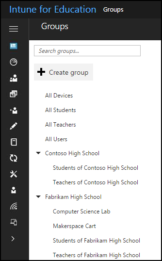

---
# required metadata

title: Core concepts and key terms
titleSuffix: Intune for Education
description: Learn information that works across enterprise mobility management with Intune.
keywords:
author: barlanmsft
ms.author: barlan
manager: angrobe
ms.date: 03/24/2017
ms.topic: article
ms.prod:
ms.service:
ms.technology:
ms.assetid: 166ef52f-e3d2-4b82-94b0-775e6cf40cf6
searchScope:
- IntuneEDU

# optional metadata

#ROBOTS:
#audience:
#ms.devlang:
#ms.reviewer: [ALIAS]
#ms.suite: ems
#ms.tgt_pltfrm:
#ms.custom:

---

# Core concepts and key terms in Intune for Education

Intune for Education tries to simplify certain complex tasks that you do to manage educational devices. There are certain concepts that may not be easily apparent; the purpose of this page is to help clarify these for you.

## How is Intune for Education different from Microsoft Intune?
Intune for Education is designed to meet the specific needs of schools and school districts. Intune for Education currently lets you manage Windows 10 devices with MDM capabilities, with a selection of all policies available in Intune. Intune for enterprises can manage additional platforms, such as iOS and Android, and can access a [different set of these rules](https://docs.microsoft.com/intune-azure) than Intune for Education.

> [!NOTE] You are also able to [access the full set of Intune management controls](https://docs.microsoft.com/intune-azure) as part of your access to Intune for Education.

## What are tenants?

Consider how you access Intune for Education. Everyone in your organization is able to access it, but they see their own instance of the admin console. This is happening while other organizations access Intune for Education in the same way. Microsoft hosts and isolates all of the data from your organization from these other organizations in a _tenant_, or a single instance of software that is simultaneously serving these other customers.

  

When you modify [tenant settings](tenant-settings.md), you are modifying settings for just your instance of Intune for Education.

## What is group inheritance?

Groups are set up as tiers, with one group above another. This makes it easier to organize large groups of users, apps, and devices.

  

If you have a group with a subgroup underneath it, the subgroup will automatically inherit whatever changes you make to the group above it. This is called _inheritance_.

### What if group inheritance doesn't work for part of my school or organization?

Let's assume that you're managing a school district, and that you've organized all devices as __School District__ > __School__ > __Grade__ > __Cart Number__. Halfway through the year, one of the schools adds a computer lab, so there's now a group of devices that doesn't work according to your current setup - for example, they can only remain logged in for only 30 minutes before automatically logging out. This is where overriding settings comes into play.

  

If the __Computer Lab__ group under the __School__ group needs to have different settings, you can override the inheritance of settings from the group to the subgroup.

  

Overriding inheritance means that you must manually manage that group's settings. When you break this chain, all inheritance is broken - including for any new settings you apply to groups higher up in the list.

You can also restore inheritance and the settings from groups to back to subgroups.

  

When you do this, Intune for Education will reset the settings to show what the settings were for the higher-level group.

## Role-based access controls

_Roles_ help you control who can perform various actions in Intune for Education. You can either use built-in roles, or you can create your own roles. You therefore control admin's access by granting or limiting their access on the basis of their role. You can find out more about [the full experience managing roles in the Intune documentation](https://docs.microsoft.com/intune-azure/access-control/role-based-access-control).

## Find out more

- [Find out more concepts and terms glossary for Intune](https://docs.microsoft.com/intune/understand-explore/intune-glossary)
- [Find out more about the full experience managing roles in the Intune documentation](https://docs.microsoft.com/intune-azure/access-control/role-based-access-control)
