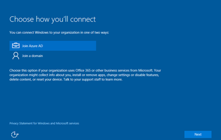

---
# required metadata

title: Add devices  | Intune for Education | Microsoft Docs
description:
keywords:
author: barlanmsft
ms.author: barlan
manager: angrobe
ms.date: 03/24/2017
ms.topic: article
ms.prod:
ms.service:
ms.technology:
ms.assetid: c884df47-61a9-4799-a407-8cd311d376d1

---

# Add devices to Intune for Education

Once you have Intune for Education set up with your school information and the apps and settings you want on your devices, you need to connect those devices with Intune for Education so the apps and settings can be applied. You can do this as part of the setup experience on new Windows 10 devices.

> [!NOTE]
> To complete setup, devices need access to the internet and your account must have enough Intune for Education device licenses available.

## How to bring devices into Intune management

To bring Windows 10 devices into management by Intune for Education, do the following:
1. After purchasing Microsoft Education Suite (not sure about product name yet), power on your new Windows 10 device and get started with Windows setup. When you reach the **Who owns this PC?** screen, select **My work or school owns it**.

  
2. On the **Choose how you'll connect** screen, select **Join Azure AD**.

  
3. Enter account credentials for the Intune administrator or **other permissioned enrollment user** and click **Next**.

Your device will authenticate with Azure AD and, after completing setup, the device will install your apps and settings.

><!-- [&larr; **Add apps**](.\add-apps.md)    [**Install apps** &rarr;](.\install-apps.md)  -->
