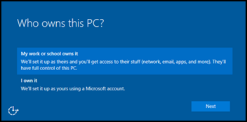
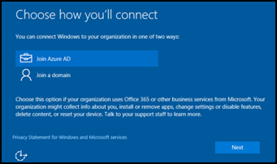

---
# required metadata

title: Add devices
titleSuffix: Intune for Education
description: Learn how to set up Windows 10 devices for Intune for Education.
keywords:
author: lenewsad
ms.author: lanewsad
manager: angrobe
ms.date: 05/10/2017
ms.topic: article
ms.prod:
ms.service: microsoft-intune
ms.technology:
ms.assetid: c884df47-61a9-4799-a407-8cd311d376d1
searchScope:
 - IntuneEDU

# optional metadata

#ROBOTS:
#audience:
#ms.devlang:
#ms.reviewer: travisj
#ms.suite: ems
#ms.tgt_pltfrm:
#ms.custom: intune-education

---

# How do I add devices to Intune for Education?

After you've set up Intune for Education with your information — such as student records, apps, and settings for devices — you need to connect the devices to Intune for Education. You can do this as part of the setup experience for new Windows 10 devices.

> [!NOTE]
> Your devices need access to the Internet and your account must have enough Intune for Education device licenses available to complete setup. You can find out more about this in our [licenses docs](https://docs.microsoft.com/intune/get-started/start-with-a-paid-subscription-to-microsoft-intune-step-4).

## Add devices to Intune for Education

You'll need to bring do the following to bring Windows 10 devices into management by Intune for Education:

1. Turn on your new Windows 10 device and begin the standard Windows setup. When you reach the **Who owns this PC?** screen, select **My work or school owns it**.

   

2. On the **Choose how you'll connect** screen, select **Join Azure AD**.

   

3. Enter the account details for the Intune for Education admin or **other permissioned enrollment user** and select **Next**.

Your device will [authenticate with Azure AD](https://docs.microsoft.com/azure/active-directory/active-directory-conditional-access) and will receive the assigned apps and settings once setup completes.

Another way to enroll devices is through the [free __Set up School PCs__ app](how-should-i-enroll-devices.md) to quickly set up PCs using a USB key. 

## Find out more
- [Find out more about the **Set up School PCs** app](https://docs.microsoft.com/education/windows/use-set-up-school-pcs-app)
- [Find out more about the full experience adding devices into Intune](https://docs.microsoft.com/intune/deploy-use/enroll-devices-in-microsoft-intune)
