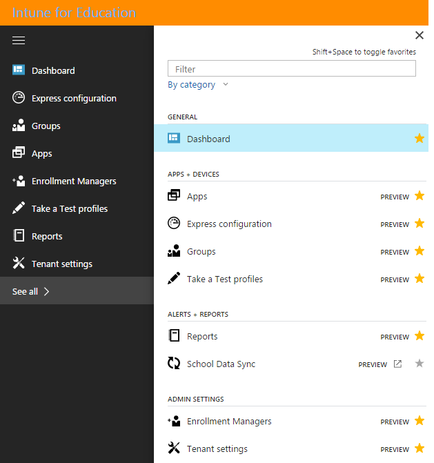

---
# required metadata

title: How do I customize my dashboard?
titleSuffix: Intune for Education
description: Learn how to customize your dashboard and sidebar in Intune for Education.
keywords:
author: barlanmsft
ms.author: barlan
manager: angrobe
ms.date: 05/02/2017
ms.topic: article
ms.prod:
ms.service: microsoft-intune
ms.technology:
ms.assetid: ce79202e-e6b4-4e1d-b0e5-26496f9e49a2
searchScope:
- IntuneEDU

# optional metadata

#ROBOTS:
#audience:
#ms.devlang:
#ms.reviewer: [ALIAS]
#ms.suite: ems
#ms.tgt_pltfrm:
#ms.custom: intune-education

---

# How do I customize my dashboard?

Your _dashboard_ is the main landing page for Intune for Education. It is where you will start every time you log in to the portal to manage your users, apps, and devices.

  

The dashboard is made up of tiles that let you quickly get to work using Intune for Education. These tiles include:

- [Express Configuration](what-is-express-configuration.md)
- [School Data Sync](what-is-school-data-sync.md)
- [Manage user and device groups](what-are-groups.md)
- [Manage apps](how-to-add-apps.md)

These tiles will show different information based on whether they're fully set up and how many items are in each of the various categories.

## How do I customize the sidebar?

On every page in Intune for Education, you'll see the _sidebar_, a list of all the things that you can do to manage users, apps, and devices.

  

There are other things you can do with Intune for Education than just those tasks presented in the list. If you choose **See all** at the bottom of the list, the full **service menu** will pop out and allow you to see all of the settings available.

  

If you want to change the order of what appears in the sidebar, you can hover over any item and wait for three vertical dots to appear. Select these dots, then drag the item to the position in the list where you'd like it to appear.

  

You can also hide the sidebar by selecting the __menu button__ on the top left corner of the sidebar. This will collapse the sidebar so that you only see the icons for those actions. If you select the __menu button__ again, the full names of each list item will reappear.  

## Find out more

- [Find out more about the full Intune device management experience](https://docs.microsoft.com/intune/understand-explore/introduction-to-microsoft-intune)
