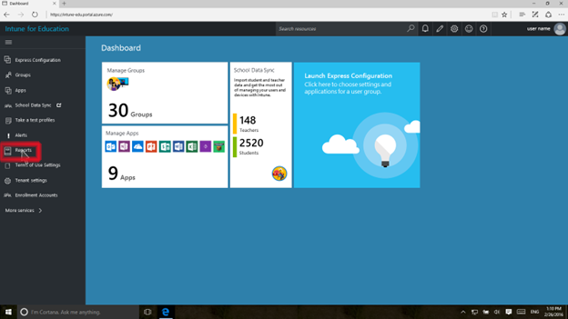

---
# required metadata

title: What are reports?  | Intune for Education | Microsoft Docs
description:
keywords:
author: NathBarn
ms.author: nathbarn
manager: angrobe
ms.date: 03/24/2017
ms.topic: article
ms.prod:
ms.service:
ms.technology:
ms.assetid: a5922c35-261c-43db-9c7b-c5c93af9cbec

---

# What are reports in Intune for Education?

Intune for Education for education provides reports that let you monitor your resources.

## View Intune for Education reports

To view reports for Intune for Education, do the following:

1. In the [Intune for Education](https://manage.windowsazure.com) console, click **Reports** in the left navigation bar.

2. Select the report you want to view. The following reports are available in Intune for Education:
  - **Device Inventory** - Displays a list of devices managed by Intune for Education.  
  - **Application Inventory** Displays a list of apps installed on Intune for Education devices, including the number of devices with the app installed.

## Export an Intune for Education report

You can export Intune for Education reports. In the [Intune for Education](https://manage.windowsazure.com) console, on the **Reports** screen, click the **Download report** button to export and download a report as a .csv file.

>[!div class="step-by-step"]

><!-- [&larr; **Add apps**](.\add-apps.md)    [**Install apps** &rarr;](.\install-apps.md)  -->
