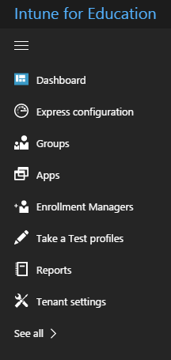
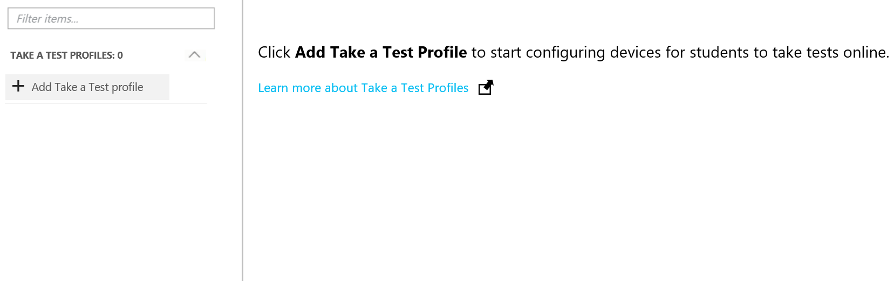
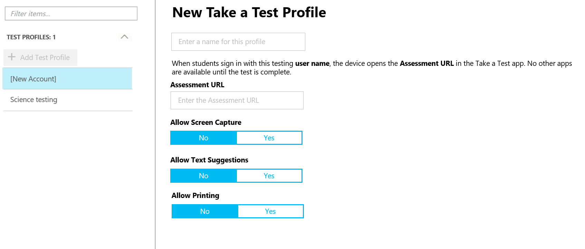
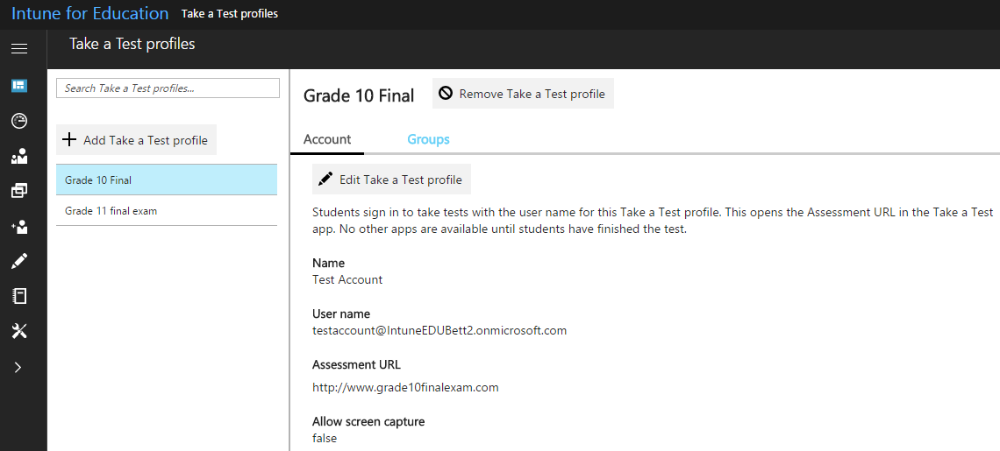

---
# required metadata

title: How do I use Take a Test profiles?
titleSuffix: Intune for Education
description: Learn how to use Take A Test profiles to make it easy to administer and capture student test results.
keywords:
author: barlanmsft
ms.author: barlan
manager: angrobe
ms.date: 04/17/2017
ms.topic: article
ms.prod:
ms.service:
ms.technology:
ms.assetid: 3ad65b15-015a-402e-9dd5-0748dee79459
searchScope:
- IntuneEDU

# optional metadata

#ROBOTS:
#audience:
#ms.devlang:
#ms.reviewer: [ALIAS]
#ms.suite: ems
#ms.tgt_pltfrm:
#ms.custom:

---

# How do I use Take a Test profiles?

_Take a Test profiles_ are designed to make it easy for you to administer formative and summative assessments through your Windows 10 devices. Take a test creates the right environment for taking a test:

- Take a Test shows just the test and nothing else.
- Take a Test clears the clipboard.
- Students aren’t able to go to other websites.
- Students can’t open or access other apps.
- Students can't share, print, or record their screens.
- Students can’t change settings, extend their display, see notifications, get updates, or use autofill features.
- Cortana is turned off.

You can set up Take a Test profiles by selecting **Take a Test profiles** from the choices in the sidebar.

  

Select **Add Take a Test profile** to proceed.

  

You'll need to provide a **Name for this profile**, the **Assessment URL**, and to decide whether to allow **Screen capture**, **Text suggestions**, or **Printing**.

  

Once a Take a Test profile has been created, you can view the details about it when you select its name from the list of Take a Test profiles.

  

## Find out more

- [Find out more about Take a Test](https://technet.microsoft.com/edu/windows/take-tests-in-windows-10)
