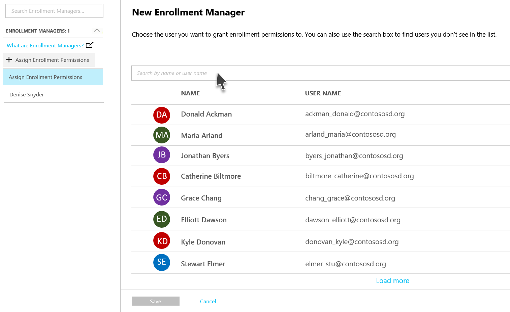
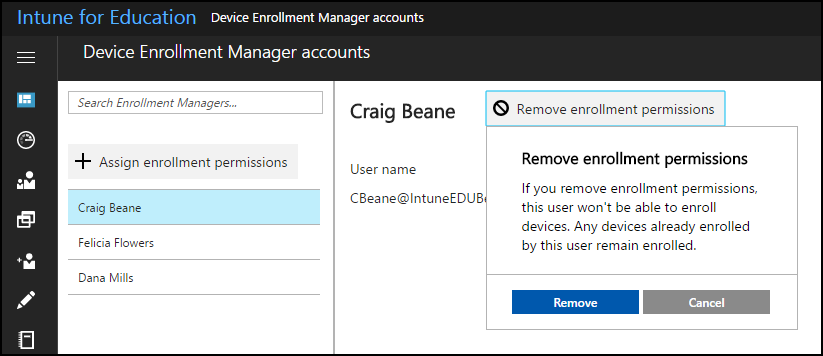

---
# required metadata

title: What are Enrollment Managers?
titleSuffix: Intune for Education
description: Learn how to use Enrollment Managers in Intune for Education.
keywords:
author: barlanmsft
ms.author: barlan
manager: angrobe
ms.date: 05/02/2017
ms.topic: article
ms.prod:
ms.service: microsoft-intune
ms.technology:
ms.assetid: b496bc02-714e-4391-b533-4c9bdcf57483
searchScope:
- IntuneEDU

# optional metadata

#ROBOTS:
#audience:
#ms.devlang:
#ms.reviewer: [ALIAS]
#ms.suite: ems
#ms.tgt_pltfrm:
#ms.custom: intune-education

---

# What are enrollment managers in Intune for Education?

Using Intune for Education to enroll large numbers of devices can be done with a single, or just a few, user accounts. The _enrollment manager_ is a special user account that can enroll up to 1,000 devices. You take an existing user and make them an enrollment manager to give them special enrollment capabilities.

  

The enrollment manager's job to help you enroll multiple shared devices by splitting up the load among multiple users. When you select __Enrollment Managers__ from the sidebar, it will show you the list of currently authorized enrollment managers.

  

Select the person that you want to make an enrollment manager, then select __Save__.

## Removing enrollment managers

You use the same list to remove individual's Enrollment User access. Locate the name of the enrollment manager you wish to remove, then select **Remove Enrollment Permissions**.

  

Even though that user is no longer an enrollment manager, the devices that they enrolled while they were enrollment manager will remain managed by Intune for Education.

## Find out more

- [Find out more about the full enrollment manager experience in Intune](https://docs.microsoft.com/intune/deploy-use/enroll-corporate-owned-devices-with-the-device-enrollment-manager-in-microsoft-intune)
