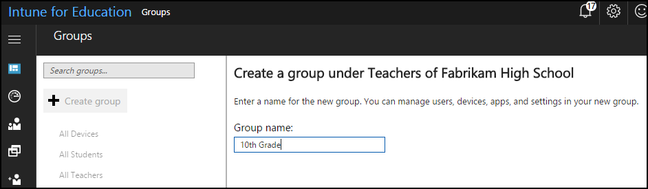
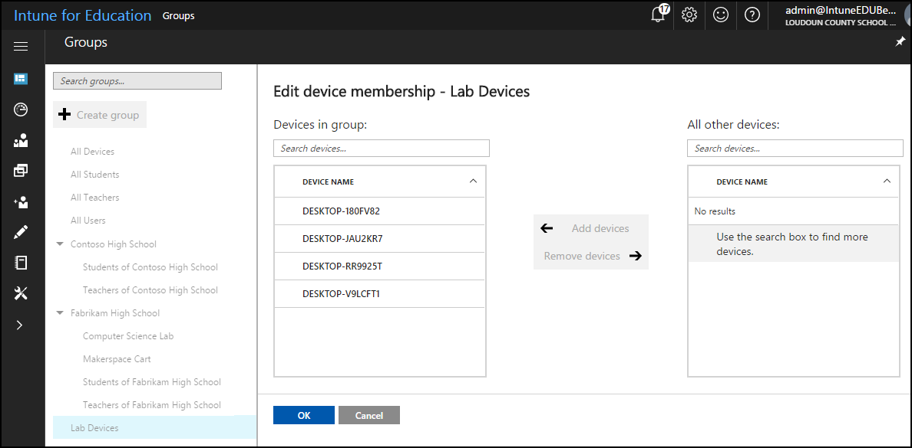
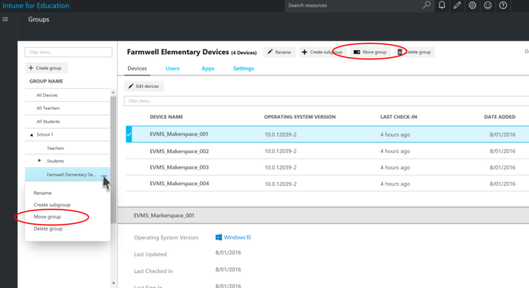
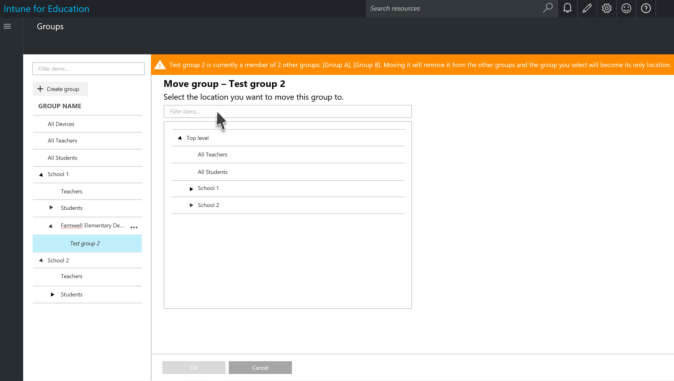
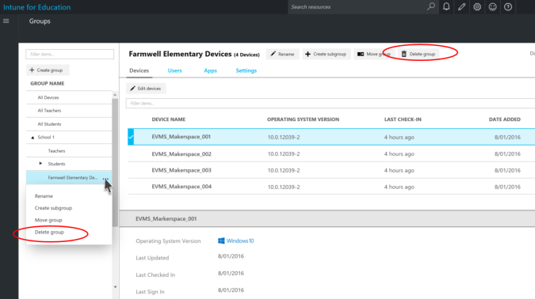

---
# required metadata

title: What are groups?
titleSuffix: Intune for Education
description: Learn how to manage groups of devices with Intune for Education.
keywords:
author: barlanmsft
ms.author: barlan
manager: angrobe
ms.date: 02/13/2018
ms.topic: article
ms.prod:
ms.service: microsoft-intune
ms.technology:
ms.assetid: 4b570196-a640-4d13-8e01-8e8553ce1468
searchScope:
- IntuneEDU

# optional metadata

#ROBOTS:
#audience:
#ms.devlang:
#ms.reviewer: rashok
#ms.suite: ems
#ms.tgt_pltfrm:
#ms.custom: intune-education

---

# What are groups?

You use _groups_ to manage users, apps, and devices in Intune for Education. You can group users or devices together instead of having to manage each device individually. This lets you easily assign apps and settings to large numbers of users and devices.

When you create groups, consider how you plan to apply the settings and apps to users and devices. For example, you may need to block apps from using location services for all devices. Specific groups may need certain things, like giving students taking [AP Computer Science](https://www.tealsk12.org) apps to edit their code.

Settings are applied to groups. Since groups are set up as hierarchies, with one group above another, [any settings applied to a group are inherited by all of its subgroups](settings-inheritance.md). Settings inheritance makes it easier to apply settings to large groups of users, apps, and devices. You can use [delegated permissions](group-admin-delegate.md#how-do-i-assign-admin-groups) to give admin groups access to manage groups underneath them.

Intune for Education automatically creates the __All Devices__ and __All Users__ groups when your tenant is created. These default groups represent the broadest categories of users and devices in your school or school district, and [cannot be changed](what-are-groups.md#why-cant-i-change-the-all-devices-all-users-all-students-or-all-teachers-groups).

## Group types

There are two types of groups that you can use to organize users and devices in Intune for Education: **assigned** groups and **dynamic** groups.

### Assigned groups

Assigned groups are used when you want to and manually add users or devices as group members. Think of it like organizing a folder together: you choose the right files to go in that folder, and that's where you find them when you need those files. As with folders, you can create subgroups that work to further organize your larger groups into smaller ones.

### Dynamic groups

Dynamic groups let you skip the process of manually adding group members instead of having to add them yourself. They are created using rules, which search your tenant for whatever students or devices meet your criteria. For example, you could create a dynamic group that shows all of the students graduating at the end of this year. If a student was unexpectedly unable to graduate, you wouldn't be able to manually remove them from this dynamic group. Instead, you'd have to change that student's graduation year, which would remove them from the group.

> [!TIP]
> Dynamic groups are great for managing large groups of objects. Manually assigning devices and users to groups in a very large school district will require a significant amount of time and manual effort to organize. Using dynamic groups to filter along existing criteria - for example, if your devices are named *DeviceType_School_Grade_0001* - can make it very easy to manage large numbers of users and devices.

Since dynamic groups can only contain what their rules define, you can't create subgroups underneath them. 

## Managing groups and subgroups

You can create groups by navigating to **Groups**, then selecting **Create Group** from the top of the group list. You can further organize groups by creating *subgroups* under any group, except for __All Devices__ or __All Users__.

  

1. In the [Intune for Education console](https://intuneeducation.portal.azure.com), select **Manage user and device groups**.
2. Select the group beneath which you want to create a subgroup.
3. Click **Create subgroup**, then enter the **Group Name**.

## Making changes to groups

After you've created a group, you may need to edit its membership — for example, if a device needs to transferred to another school in your district.

  

1. Select the group whose members you want to edit.
2. Select the **Devices** tab.
3. Select the **Edit devices** button, then choose **Add Devices** to add more devices from a list or the **X** next to a device to delete it.

If you need to rename a group, select the group that needs to be renamed, then the **Rename** button to edit the name.

## Move a group

You can move a group within your group structure, or **hierarchy**.

  

1.	In the [Intune for Education portal](https://intuneeducation.portal.azure.com), choose **Manage Groups**.
2. Select the group that needs to be Moved.
3.	Click **Move group** either in the menu list or by choosing the **Move group** button.
4.	Select the group location to which you want to move the group by either searching a group name or by selecting it in the hierarchy.
5.	Select **OK** to save your changes.

## Why can't I change the "All Devices", "All Users", "All Students", or "All Teachers" groups?

Intune for Education provides a set of default, [tenant-level groups](what-are-tenants.md) that are created when your school's account is created. These groups, **All Users** and **All Devices**, cannot be changed. The **All Teachers** and **All Students** groups are similarly created after School Data Sync has imported student and teacher data into Intune for Education.

This structure may rarely cause an issue where you may end up with a subgroup underneath two groups. If this issue occurs, you need to choose a single group to place above this subgroup.

  <!---->

## Why can't I edit this group?

Intune for Education displays a subset of all dynamic attributes that are available in Intune. If a dynamic attribute isn't available in the Intune for Education console, you have to go to Intune or Azure Active Directory to edit it.

Intune for Education is designed to be an easy way to manage devices in your schools. It uses [Intune](https://docs.microsoft.com/intune/what-is-intune), an enterprise product, to manage apps and groups. Certain admins in your organization need to use both the full Intune console and the Intune for Education console to create special groups. If you can't edit a group, it's likely that you don't have access to the full Intune console to modify these groups.

## Delete a group

When you delete a group, Intune for Education removes the collection of apps and settings on any device that is a member of that group. Deleting a group does not remove those users or devices from management.

  

1.	In the [Intune for Education portal](https://intuneeducation.portal.azure.com), choose **Manage Groups**.
2. Select the group you want to delete
3.	Click **Delete group** either in the task list.

## Find out more

- [Find out more about the full groups management experience in Intune](https://docs.microsoft.com/intune/deploy-use/use-groups-to-manage-users-and-devices-with-microsoft-intune)
