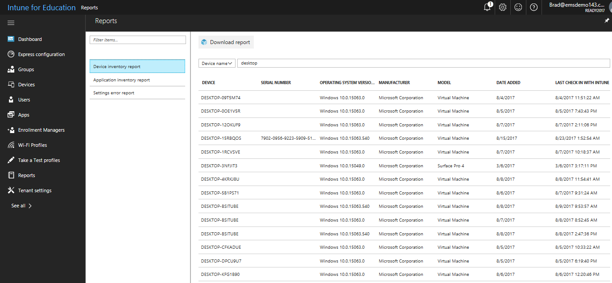
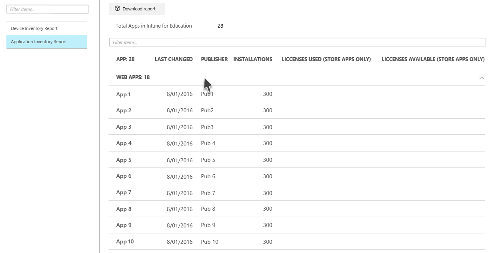

---
# required metadata

title: What are reports?  
titleSuffix: Intune for Education
description: Learn how reports can help you understand activity in Intune for Education.
keywords:
author: barlanmsft
ms.author: barlan
manager: angrobe
ms.date: 04/25/2017
ms.topic: article
ms.prod:
ms.service:
ms.technology:
ms.assetid: a5922c35-261c-43db-9c7b-c5c93af9cbec
searchScope:
- IntuneEDU

# optional metadata

#ROBOTS:
#audience:
#ms.devlang:
ms.reviewer: tanmayb
#ms.suite: ems
#ms.tgt_pltfrm:
#ms.custom:

---

# What are reports in Intune for Education?

Intune for Education provides reports that let you view certain activities from devices and apps managed with Intune for Education. You can download these reports to review them offline.

There are currently two kinds of reports that you can view in Intune for Education: __Device Inventory__ and __Application Inventory__.

1. In the [Intune for Education](https://intuneeducation.portal.azure.com) console, choose **Reports** in the left navigation bar.

2. Select the report you want to view. The following reports are available in Intune for Education:

  - **Device Inventory** - A list of devices managed by Intune for Education

  

  - **Application Inventory** A list of apps installed on devices under management by Intune for Education, including the number of devices with that app installed

  

  You can also select the type of app (web app, Win32 app, Microsoft Store app) to only show information about that specific kind of app.

## Download reports

You can also download Intune for Education reports. In the [Intune for Education](https://intuneeducation.portal.azure.com) console, on the **Reports** screen, choose the **Download report** button to export and download a report as a comma-separated value (.csv) file that can then be viewed and modified in a spreadsheet app such as [Excel](https://support.office.com/article/Import-or-export-text-txt-or-csv-files-5250ac4c-663c-47ce-937b-339e391393ba).

## Find out more

- [Monitor your apps and devices with reports using Intune for enterprises](https://docs.microsoft.com/intune/deploy-use/understand-microsoft-intune-operations-by-using-reports)
