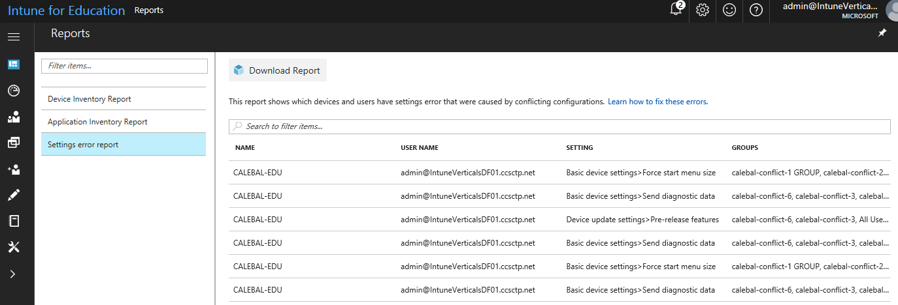

---
# required metadata

title: What are reports?  
titleSuffix: Intune for Education
description: Learn how reports can help you understand activity in Intune for Education.
keywords:
author: lenewsad
ms.author: lanewsad
manager: angrobe
ms.date: 01/22/2018
ms.topic: article
ms.prod:
ms.service: microsoft-intune
ms.technology:
ms.assetid: a5922c35-261c-43db-9c7b-c5c93af9cbec
searchScope:
- IntuneEDU

# optional metadata

#ROBOTS:
#audience:
#ms.devlang:
ms.reviewer: travisj
#ms.suite: ems
#ms.tgt_pltfrm:
#ms.custom: intune-education

---

# What are reports in Intune for Education?

Intune for Education provides reports that let you view certain activities from devices and apps managed with Intune for Education. You can download these reports to review them offline.

There are currently three kinds of reports that you can view in Intune for Education: __Device Inventory__, __Application Inventory__, and __Settings Errors__.

1. In the [Intune for Education](https://intuneeducation.portal.azure.com) console, choose **Reports** in the left navigation bar.

2. Select the report you want to view. The following reports are available in Intune for Education:

   * **Device inventory** — A list of devices managed by Intune for Education.

   

   * **Application inventory** — A list of apps installed on devices under management by Intune for Education, including the number of devices with that app installed.

   

   * **Settings errors** — A list of settings that are [currently in conflict](settings-inheritance.md) for any groups in your hierarchy.

   

   * **Windows Defender** - View Windows Defender device health status for all your devices.

   You can also select the type of app (web app, Desktop app, Microsoft Store app) to only show information about that specific kind of app.

## Download reports

You can also download Intune for Education reports. In the [Intune for Education](https://intuneeducation.portal.azure.com) console, find the report you're interested in downloading. Choose the **Download report** button to export and download a report as a comma-separated value (.csv) file that can then be viewed and modified in a spreadsheet app such as [Excel](https://support.office.com/article/Import-or-export-text-txt-or-csv-files-5250ac4c-663c-47ce-937b-339e391393ba).

## Find out more

- [Find out more about the full reporting experience in Intune](https://docs.microsoft.com/intune/deploy-use/understand-microsoft-intune-operations-by-using-reports)
- [Find out more about reporting using Microsoft Graph](https://developer.microsoft.com/graph/docs/overview/overview)
