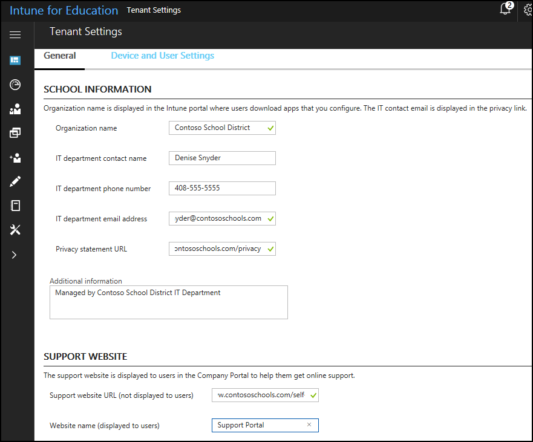

---
# required metadata

title: What are tenants?
titleSuffix: Intune for Education
description: Learn how to manage your tenant with tenant-wide settings.
keywords:
author: barlanmsft
ms.author: barlan
manager: angrobe
ms.date: 05/02/2017
ms.topic: article
ms.prod:
ms.service: microsoft-intune
ms.technology:
ms.assetid: 50bd115f-a167-456a-910d-8f31ec17a422
searchScope:
 - IntuneEDU

# optional metadata

#ROBOTS:
#audience:
#ms.devlang:
#ms.reviewer:
#ms.suite: ems
#ms.tgt_pltfrm:
#ms.custom: intune-education

---

# What are tenants?

Your _tenant_ is your organization's complete instance of Intune for Education. Modifying things at the tenant level don't impact a single group, or even a large group like **All Students**. These modifications affect every device under management and every person in your organization using those devices, across your entire subscription and for all of your licenses.

## How do I manage tenant-wide settings in Intune for Education?

Certain settings affect all users and devices you have under management. Intune for Education refers to these as **tenant settings**. Only Intune for Education admins can see or change these settings.

To manage these settings, choose **Tenant settings** in the left-side navigation bar in the [Intune for Education](https://intuneeducation.portal.azure.com) console.

  

These settings include __IT contact information__, such as who is the __IT department contact__, their __phone number__, and __email address__. It is also where you will define your organization's __privacy statement URL__.

Tenant settings are also where you can force a sync between Intune for Education and Microsoft Store for Education if app purchases are taking too long to appear in Intune for Education.

## Find out more

- [Find out more about setting up role-based access in the full management experience in Intune](https://docs.microsoft.com/intune-azure/access-control/role-based-access-control)
