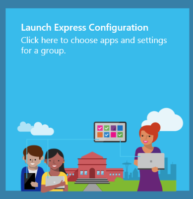
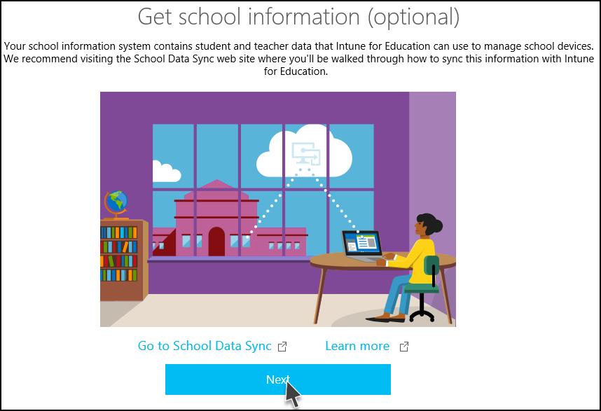
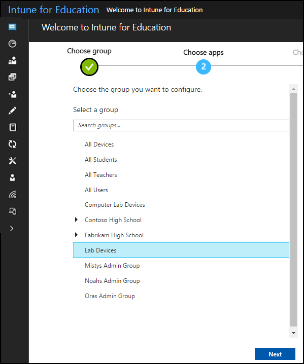
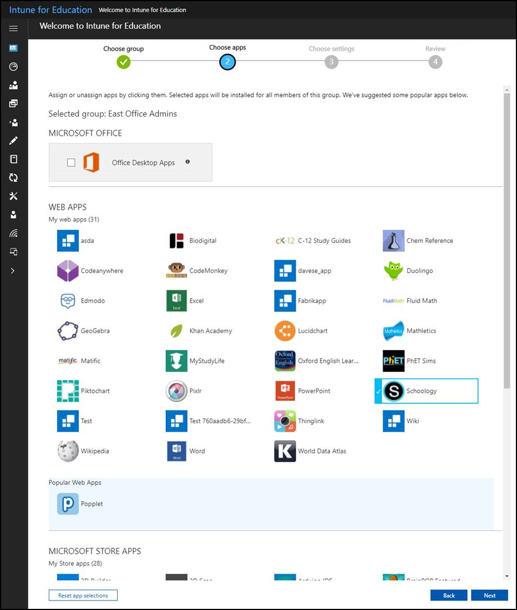
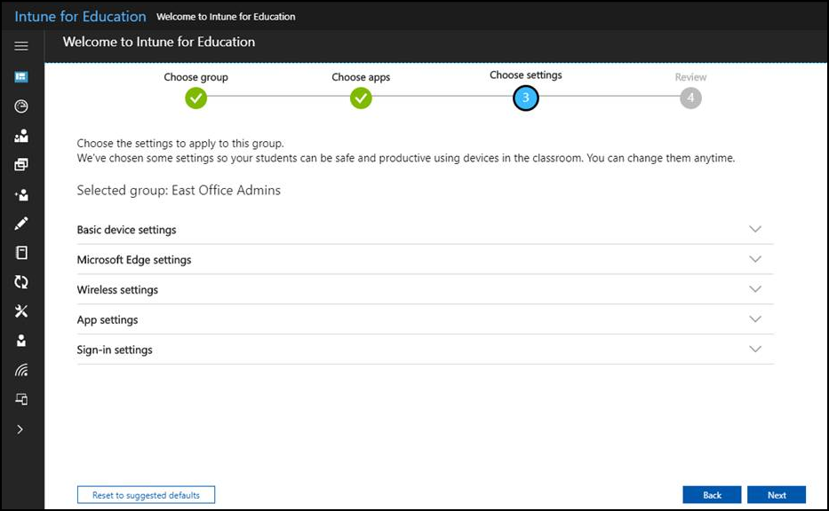

---
# required metadata

title: What is Express Configuration?
titleSuffix: Intune for Education
description: Use Express Configuration to quickly set up your groups in Intune for Education.
keywords:
author: barlanmsft
ms.author: barlan
manager: angrobe
ms.date: 03/24/2017
ms.topic: article
ms.prod:
ms.service:
ms.technology:
ms.assetid: af5d35ee-84f5-4245-a441-671600bcc376
searchScope:
 - IntuneEDU

# optional metadata

#ROBOTS:
#audience:
#ms.devlang:
#ms.reviewer:
#ms.suite: ems
#ms.tgt_pltfrm:
#ms.custom:

---

# What is Express Configuration?

Express Configuration is the one of the most prominent tiles that you see when you first sign in to Intune for Education.

  

Express Configuration helps you quickly provide a group of users the apps and settings they need. It's not something that you're limited to just using once; you can use it anytime you want to make changes to any group you manage. We’ve chosen some apps and default settings that we think you’ll find useful. You can change these choices to fit your needs.

## Get school information

**Optional/Prep-work**: Intune for Education doesn't come set up with your information in it in advance. This means that you or someone in IT must get any student, teacher, or employee records into Intune for Education before you can begin using it to manage them. One way to approach this is to sync your School Information System (SIS) with Intune. This makes information about student names, teacher names, and classes available in the Intune for Education console so you can assign specific apps and settings to groups of students and teachers.

  

The advantage to doing this is that it brings the most current information from your SIS into Intune for Education. Express Configuration uses [School Data Sync](what-is-school-data-sync.md) through a few different ways, depending on the services available to your school or school district. You can use third-party services like PowerSchool or Clever, or export data files from your information service and import them directly. This information is then added to Microsoft's [Azure Active Directory service](https://microsoft.com), which manages that data for Intune for Education.

  

## Choose a group

You’ll start by selecting a group to configure.

  

A _group_ in Intune for Education is a collection of devices or users that are organized to make it easy to understand who or what you're managing. This could be devices (like _Sixth Grade Computer Cart_) or users (like _Fourth Grade Students_ or _Biology Teachers_). Intune for Education comes preset with groups based on the school information you've provided. We've got more information about groups available in our [groups articles](what-are-groups.md).

We recommend that you start by assigning settings that you know **All Users** will need, like password requirements or blocking pop-ups in Microsoft Edge.

Select a group to set up, then choose **Next** to continue.

## Choose apps

Now, you'll choose an app to assign to this group.

  

There are multiple kinds of apps available to install on devices, including desktop apps, Microsoft Store for Business apps, and web apps. Intune for Education also displays popular apps from the Microsoft Store for Business from across all Intune for Education users. We've got more information about apps available in our [apps articles](what-are-apps.md).

Select apps to assign to this group, then choose **Next** to continue.

## Choose settings

Next, you’ll choose the device settings you want to apply to the devices or users in your group.

  

Express Configuration shows you settings that you may want to get your groups ready to go. These settings are a selection of the full [list of settings available as part of Intune](https://docs.microsoft.com/intune/deploy-use/manage-settings-and-features-on-your-devices-with-microsoft-intune-policies). You can change these selections at any time to fit your needs and later you can view the full list in the Intune for Education console to fine-tune settings. We've got more information about settings available in our [settings articles](what-are-settings.md).

## Finish up

After you make your selections, you have a chance to review the apps and settings you've chosen. You can then choose the **Finish** button or go back to any steps to modify these configurations.

  

When you are done, you will be taken to the Intune for Education dashboard where you can continue to manage your devices, users, and apps. You can come back to Express Configuration any time from the dashboard or the navigation menu to add, remove, or modify apps and settings for any group.

## Next steps

After you have set up your groups with the apps and settings they need, you're ready to start using devices with Intune for Education.
