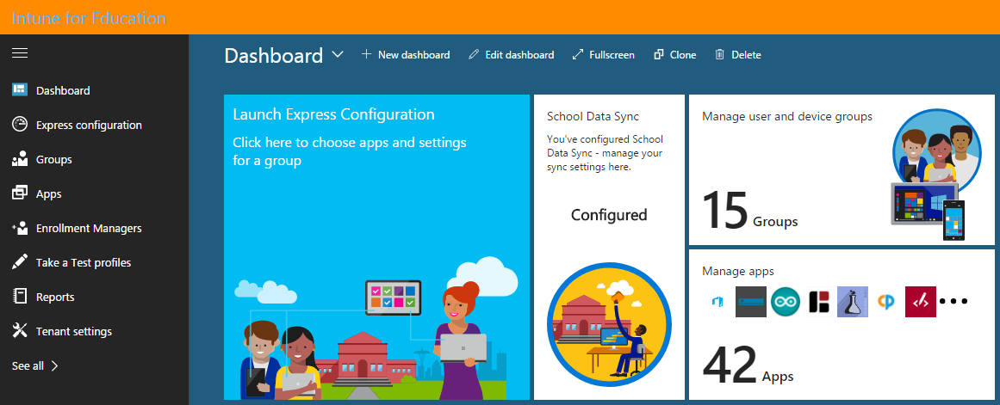

---
# required metadata

title: What is Intune for Education?
titleSuffix: Intune for Education
description: Learn about Intune for Education and how it can make managing Windows 10 devices easier for educational institutions.
keywords:
author: lenewsad
ms.author: lanewsad
manager: angrobe
ms.date: 01/17/2018
ms.topic: article
ms.prod:
ms.service: microsoft-intune
ms.technology:
ms.assetid: c66e1700-aac0-44c0-af89-d5d9d4fac9ae
searchScope:
- IntuneEDU

# optional metadata

#ROBOTS:
#audience:
#ms.devlang:
#ms.reviewer: travisj
#ms.suite: ems
#ms.tgt_pltfrm:
#ms.custom: intune-education

---

# What is Intune for Education?

Microsoft Intune for Education is software that you can use to improve student learning outcomes through connected classrooms and engaging new technologies. It is accessible through our admin console, a web portal that is designed to make it possible for everyone — from professional IT admins, to part-time IT support, to teachers trying to use IT in the classroom — to get groups of Windows 10 devices up and running in minutes. It does this by giving you a streamlined admin portal to accomplish everyday things that you need to do with devices in classrooms. This can help keep students from getting off-track while using their devices and lets you evaluate learner progress with assessments.

Intune for Education can be used by itself, or in harmony with the [full device, app, and user management experience available in Intune](https://docs.microsoft.com/intune/understand-explore/introduction-to-microsoft-intune). It can also be used alongside the rest of the tools available in [Microsoft Education](https://docs.microsoft.com/education/#pivot=itpro), which makes it easy for you to use Intune for Education with other useful educational tools from Microsoft. These tools include:

- [Office 365 for Education](https://support.office.com/article/Set-up-Office-365-for-business-6a3a29a0-e616-4713-99d1-15eda62d04fa)
- [Windows 10 for Education](https://docs.microsoft.com/education/windows)
- [Microsoft Store for Education](https://docs.microsoft.com/microsoft-store/index?toc=/microsoft-store/education/toc.json)
- [Minecraft: Education Edition](https://docs.microsoft.com/education/windows/school-get-minecraft)

> [!VIDEO https://www.youtube.com/embed/ukrnCwcLvV8]

Intune for Education works closely with [Azure Active Directory (Azure AD)](https://docs.microsoft.com/azure/active-directory/active-directory-administer), [Microsoft School Data Sync](https://sds.microsoft.com), and [Office 365 for  Education](https://support.office.com/article/Get-started-with-Office-365-Education-AB02ABE5-A1EE-458C-B749-5B44416CCF14) to simplify device management. Intune for Education simplifies this process by getting automatically added as a management tool to your Azure AD and Microsoft Store tenants.

## Will Intune for Education work for shared devices?
Intune for Education works for shared devices by managing multiple users on a single device. When users who share a device have different apps and settings targeted to them, the user who is signed in sees only the apps and settings set up for them.

## Get started with Intune for Education
To get started with Intune for Education, open the [Intune for Education console](https://intuneeducation.portal.azure.com) and sign in with your school credentials. You start on the [dashboard](how-do-i-customize-my-dashboard.md), your landing page for using Intune for Education.

After you sign in, start with [Express Configuration](what-is-express-configuration.md). There you can select a group containing users (such as students or teachers) or devices (such as _2nd floor Computer Lab_ or _Eleventh Grade AP Computer Science_) and start assigning apps and settings to them.
