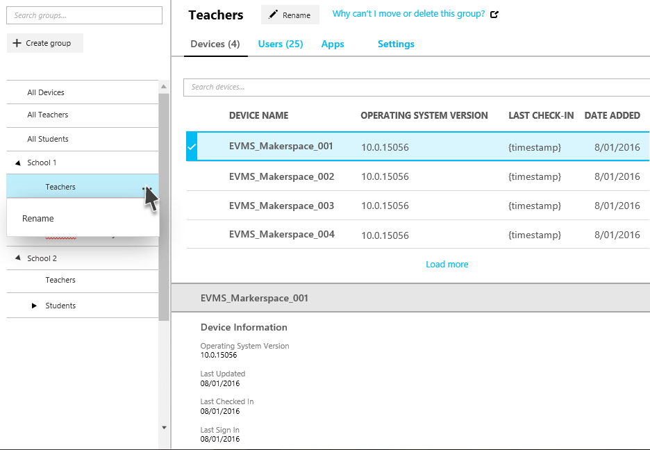

---
# required metadata

title: Why can't I move this group?
titleSuffix: Intune for Education
description: Learn why certain groups may not let you move them the way you intend in Intune for Education.
keywords:
author: barlanmsft
ms.author: barlan
manager: angrobe
ms.date: 04/25/2017
ms.topic: article
ms.prod:
ms.service: microsoft-intune
ms.technology:
ms.assetid: 4e34c493-2209-44d4-92c5-ce79f2b70e7d
searchScope:
- IntuneEDU

# optional metadata

#ROBOTS:
#audience:
#ms.devlang:
ms.reviewer: tanmayb
#ms.suite: ems
#ms.tgt_pltfrm:
#ms.custom: intune-education

---

# Why can't I move this group?

You use _groups_ to manage users, apps, and devices in Intune for Education. You can group a set of students or a set of devices to apply settings and assign apps to the group. When you create groups, consider how you will apply the settings and apps to users and devices.

  

Intune for Education provides a set of default groups, **All Users** and **All Devices** when your [tenant is created](what-are-tenants.md). These default groups represent the broadest categories of users and devices in your school or school district.

## Groups in multiple places

Depending on how you've set up your group structure, either in [Azure AD through School Data Sync](https://support.office.com/article/Overview-of-School-Data-Sync-and-Classroom-f3d1147b-4ade-4905-8518-508e729f2e91) or by manually creating them, you may end up with a subgroup directly underneath two groups.

  

If this happens, you'll need to choose a single group to place above this subgroup.
